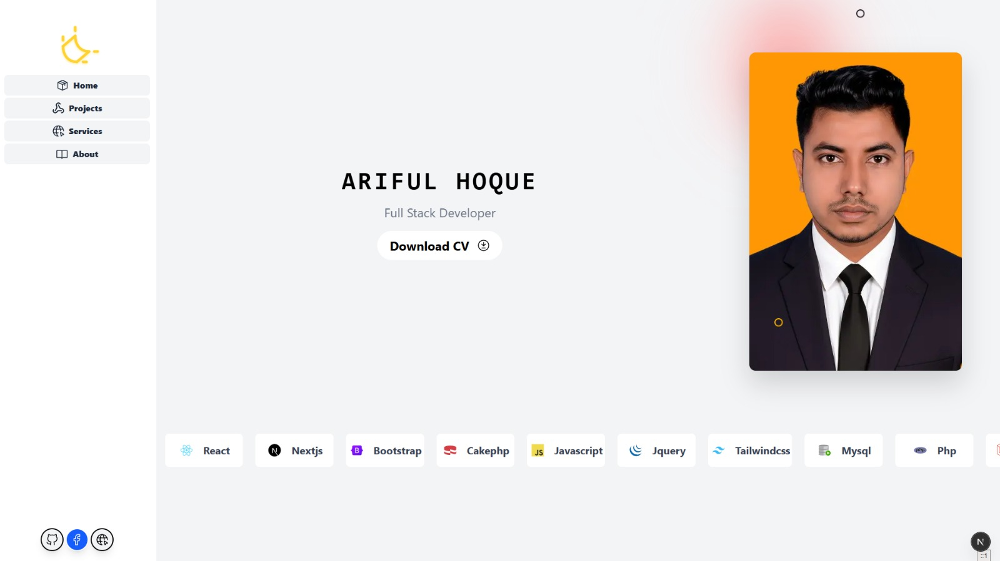

 
## Getting Started

First, run the development server:

```bash
npm run dev
# or
yarn dev
# or
pnpm dev
# or
bun dev
```


 
<p align="center" style="background-color: #222831; padding: 15px; border-radius: 15px;">
  
</p>